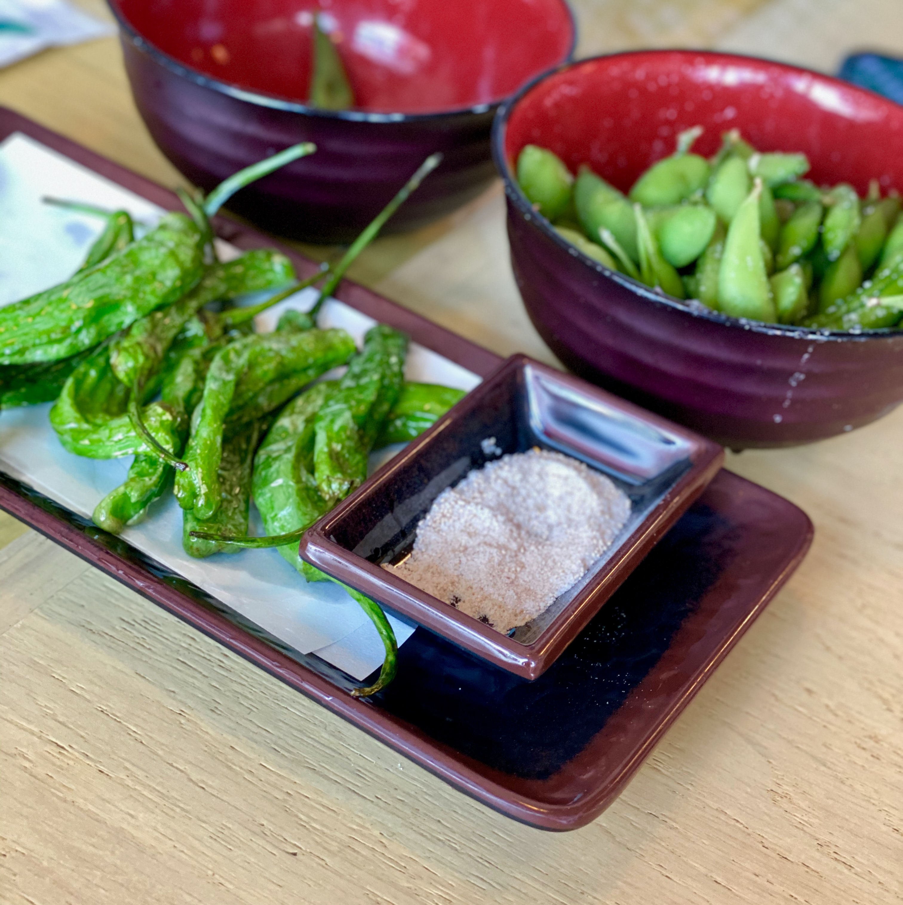

Get ready for a flavour explosion with this zesty edamame bean toast! This easy and nutritious meal is loaded with bright flavours, combining nutty and crunchy edamame beans with tangy, zesty spices and a drizzle of lemon. Topped with fresh and fragrant herbs, this dish is perfect for a quick and delicious breakfast, lunch, or snack. Whether you're looking for a healthy and satisfying meal or just want to mix up your toast game, this zesty edamame bean toast is sure to become a new favourite. 

## Ingredients:

* 2 slices of whole grain bread
* 1 cup shelled edamame beans, cooked and cooled
* 1 tablespoon extra-virgin olive oil
* 1 teaspoon lemon zest
* 1 teaspoon lemon juice
* 1/2 teaspoon chilli powder
* 1/2 teaspoon garlic powder
* Salt and pepper to taste
* 1 tablespoon chopped fresh parsley

## Method:

1. Toast the slices of whole grain bread until they are golden brown and crispy.
2. In a medium bowl, mix together the cooked and cooled edamame beans, extra-virgin olive oil, lemon zest, lemon juice, chilli powder, garlic powder, salt, and pepper.
3. Spoon the edamame mixture onto the toast slices, spreading it evenly.
4. Garnish with chopped parsley and a drizzle of extra-virgin olive oil, as desired.
5. Serve and enjoy!