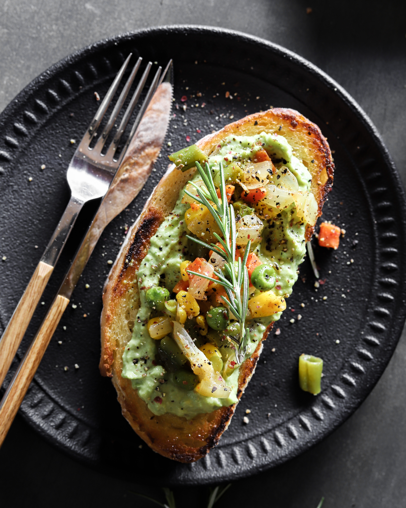

A simple and delicious way to enjoy a cult breakfast classic. Utilising a plethora of healthful ingredients, you can easily whip up this dish in minutes and relish in your back-to-basics creation of green goodness. 

## Ingredients

* 1 ripe avocado
* 2 slices of bread (we suggest a hearty sourdough)
* 1 teaspoon of olive oil
* salt and pepper to taste
* garlic powder
* chilli flakes
* lemon or lime juice (preferably fresh)
* 2 medium sized tomatoes /or a handful of cherry tomatoes 
* 1 small jalapeño pepper 
* sriracha (or hot sauce of choice)
* 1 spring onion
* honey (optional)
* balsamic glaze
* vegan bacon lardons (optional)

## Method

1. Toast bread slices until golden brown.
2. Cut the avocado in half, remove the pit, and scoop the flesh into a bowl.
3. Mash the avocado with a fork until smooth. 
4. Stir in the lemon juice, salt, and pepper. Add desired amounts of alternate seasonings, garlic powder, chilli flakes, etc.
5. Spread the avocado mixture evenly onto the toast slices.
6. Chop up tomatoes, jalapeños and spring onion.
7. Plate avocado toast and evenly distribute vegetable toppings across both slices.
8. Serve and enjoy!